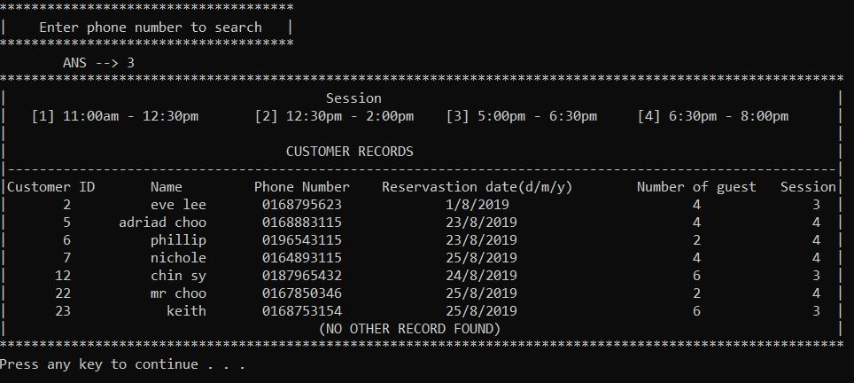

# Restaurant-Reservation-System

This repository contains my C++ assignment (May 2019), which is a console application designed to help restaurant staff manage customer reservations. The system allows staff to add, search, update, and display reservations.

## **User Requirements**

1. **Available Sessions**: 
   - There are four available sessions each day:
     - 11:00 AM to 12:30 PM
     - 12:30 PM to 2:00 PM
     - 5:00 PM to 6:30 PM
     - 6:30 PM to 8:00 PM
   - Each session has **8 slots** available.

2. **Reservation Details**: 
   - The system records the following information for each reservation:
     - Customer name
     - Customer phone number
     - Booked session
     - Reservation date
     - Number of guests

3. **Reservation Search**: 
   - The staff can search for availability based on the customer's desired booking details, such as date, session, or number of guests.

4. **Reservation Limitation**:
   - Reservations can only be added and searched for within the current month.

5. **Restaurant Closure & Booking terms**:
   - The restaurant is **closed** for the first **three days of every month**. Reservations should be placed at least **3 days in advance**.

6. **Monthly Records**:
   - Reservations for each month are stored in **separate text files** for record-keeping.

## **Functionality Requirements**

1. **Display Reservations**:
   - The system allows the staff to display all reservations or display reservations for a specific date.

2. **Search Customer Record**:
   - Staff can search for a customer's record by entering the customer's name or phone number.

3. **Check Availability**:
   - The system allows the staff to check the availability of reservations using the customer's desired date, desired session, or number of guests remaining in the available slot.

4. **Add or Update Reservation**:
   - The system enables staff to add a new reservation or update an existing reservation record.
To ensure the code works correctly, please follow these setup instructions:

## **Important Setup Note**

1. **Content of Files**: 
   - **August.txt** should consist of reservation information for August 2024.
   - **September.txt** should consist of reservation information for September 2024.

2. **Replace Reservation List**:
   - Locate `#define LIST` in the code and replace the list if necessary to match the prepared text files.
  
## **System Structure Chart**

## **Example Output**

### **1. Main Menu**

### **2. Display Reservations**
#### **Display All**

#### **Display By Date**

### **3. Search Customer Record**
#### **Search by Name**

#### **Search by Phone**

### **4. Booking Availability**
#### **Search Availability by Date**

#### **Search Availability by Session**

#### **Search Availability by Guest Slot**

### **5. Make Reservation**

## **Contributors**
- Vicrace Chan Jia Lin
- Leong Yue Chien
- Ng Sze Jin
